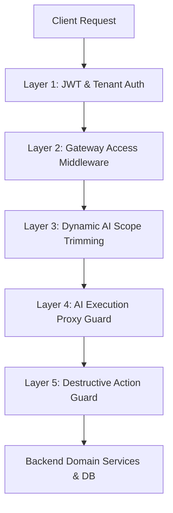

# I-TRACK AI Subsystem Role-Based Access Control (RBAC) Documentation

## 1. Executive Summary

The I-TRACK AI subsystem provides intelligent assistant capability, automated ticket generation, and natural-language API dispatch while ensuring strict adherence to enterprise Role-Based Access Control (RBAC) and tenant isolation principles.

AI operations execute **strictly in the context of the authenticated user**. The AI model cannot bypass backend permissions, view unauthorized workspace data, or execute mutations forbidden for the user's role.

---

## 2. Multi-Layer Security Architecture

The AI subsystem implements a 5-layer defense-in-depth model:



### Layer Details

| Layer | Responsibility | Mechanism | Key Functions |
| :--- | :--- | :--- | :--- |
| **Layer 1: Auth & Tenant Guard** | Validates session JWT and loads workspace context | `requireAuth`, `requireWorkspace` | Resolves `organizationId`, `userId`, `role`, and `permissions` |
| **Layer 2: Gateway Access** | Protects AI endpoints at the HTTP router boundary | `enforceApiAccess` | Validates `permissionForEndpoint` (`ai.use`) and `rolesForEndpoint` |
| **Layer 3: Scope Trimming** | Trims accessible API catalog per user role | `aiEndpointsForRole` | Filters tool endpoints and hides unauthorized route definitions |
| **Layer 4: Execution Proxy** | Re-verifies RBAC before executing proxied API tools | `canRoleAccessAiEndpoint` | Re-checks role & custom permissions before API dispatch |
| **Layer 5: Destructive Guard** | Requires explicit user confirmation for destructive actions | `isConfirmationRequired` | Blocks `DELETE` and high-risk mutations until user confirms |

---

## 3. RBAC & Permission Matrix

Permissions are governed by built-in roles (`admin`, `manager`, `engineer`, `designer`) and granular permission keys (e.g. `ai.use`, `tickets.create`, `projects.manage`).

### Role Capability Summary

| Product Area | Endpoint Group | Admin | Manager | Engineer | Designer |
| :--- | :--- | :---: | :---: | :---: | :---: |
| **AI Subsystem** | `intelligence` (`/ai/*`) | Full | Full | Use AI Chat & Read | Use AI Chat & Read |
| **Authentication** | `auth` | Full | Full | Self & Sessions | Self & Sessions |
| **Workspaces** | `workspaces` | Full | View / Switch | View / Switch | View / Switch |
| **Organizations** | `organizations` | Full | Member / Groups | Member / Groups | Member / Groups |
| **User & Roles** | `users` | Full | View Team | View Team | View Team |
| **Projects** | `projects` | Full | Manage | View Only | View Only |
| **Planning & Sprints**| `planning` | Full | Manage | View Only | View Only |
| **Tickets & Backlog** | `tickets` | Full | Full | Create / Edit / Work | Create / Edit / Work |
| **Resources** | `resources` | Full | Manage | View Only | View Only |
| **Operations & Settings**| `operations` | Full | SLA / Reports | Notifications / Read | Notifications / Read |

### Granular AI Permission Mapping

The `ai.use` permission is assigned to all built-in roles by default and covers the following AI routes:

- `GET /api/v1/ai/endpoints`
- `POST /api/v1/ai/execute`
- `GET /api/v1/ai/models`
- `GET /api/v1/ai/conversations`
- `GET /api/v1/ai/conversations/:id/messages`
- `DELETE /api/v1/ai/conversations/:id`
- `POST /api/v1/ai/chat`
- `POST /api/v1/ai/generate-tickets`
- `POST /api/v1/ai/confirm-ticket-plan` *(Requires `admin` or `manager` role)*

---

## 4. AI Subsystem Endpoints & Authorization Rules

| Method | Route Path | Permission | Allowed Roles | Description |
| :--- | :--- | :--- | :--- | :--- |
| `GET` | `/ai/endpoints` | `ai.use` | All Roles | Lists API endpoints executable by the user's role |
| `POST` | `/ai/execute` | `ai.use` | All Roles | Proxies an API call after verifying RBAC & confirmation |
| `GET` | `/ai/models` | `ai.use` | All Roles | Lists available LLM provider models |
| `GET` | `/ai/conversations` | `ai.use` | All Roles | Lists user's past AI conversations |
| `GET` | `/ai/conversations/:id/messages` | `ai.use` | All Roles | Fetches chat history for a conversation |
| `DELETE` | `/ai/conversations/:id` | `ai.use` | All Roles | Deletes a specific conversation owned by user |
| `POST` | `/ai/chat` | `ai.use` | All Roles | Conversational AI assistant endpoint |
| `POST` | `/ai/generate-tickets` | `ai.use` | All Roles | Generates structured ticket plan proposals |
| `POST` | `/ai/confirm-ticket-plan` | `ai.use` | `admin`, `manager` | Bulk inserts generated tickets into project & sprint |

> [!IMPORTANT]
> Conversations are strictly scoped to `organization = req.user.organizationId` AND `user_id = req.user.userId`. Users cannot access or delete another user's AI conversations.

---

## 5. Execution Gateway & Tool Call Proxy Security

When the AI chat assistant uses the `execute_itrack_api` function tool, it calls `executeAiRequest()` on the backend.

### Security Safeguards in `executeAiRequest`

1. **Path Normalization**: Strips origin, `/api/v1`, and `/api` prefixes (`normalizeAiPath`) to prevent path traversal or prefix manipulation.
2. **Recursion Prevention**: Directly blocks requests attempting to invoke `/ai/execute` inside `/ai/execute`.
3. **Double RBAC Verification**: Calls `canRoleAccessAiEndpoint(role, method, path, permissions)` before performing internal dispatching.
4. **Repeat Mutation Protection**: Keeps track of failed mutation attempts in `failedMutationAttempts`. Blocked if an identical body retry is attempted without user clarification.

---

## 6. Destructive Action Confirmation Framework

To prevent AI hallucinations or unintended deletions, high-risk actions require human-in-the-loop confirmation.

### Confirmation Triggers (`isConfirmationRequired`)

1. **All `DELETE` HTTP Methods**: Automatically flagged as requiring confirmation.
2. **Destructive Mutations**:
   - `POST /users/:id/deactivate`
   - `POST /projects/:id/archive`
   - `POST /sprints/:id/complete`
   - `POST /tickets/:id/archive`
   - `POST /notifications/read-all`
   - `DELETE /organization`

### Chat Interruption Protocol

When the AI assistant attempts a destructive operation without `confirmed.action`:
1. The backend halts execution before running the mutation.
2. Returns HTTP payload:
   ```json
   {
     "reply": "I need your confirmation before performing this destructive action. Please confirm to proceed.",
     "requiresConfirmation": true,
     "pendingAction": {
       "method": "DELETE",
       "path": "/tickets/ITG-101",
       "body": null,
       "description": "Confirm destructive action"
     }
   }
   ```
3. The client UI renders an explicit confirmation modal for the user.
4. Only upon user approval does the client resend the request with `confirmed: { action: "DELETE /tickets/ITG-101" }`.

---

## 7. Endpoint Matching & Path Normalization Rules

To prevent authorization bypass due to URL prefix variations, paths are normalized consistently across all middleware:

```typescript
export function normalizeApiPath(path: string): string {
  const clean = `/${path}`.replace(/\/+/g, "/");
  return clean
    .replace(/^\/api\/v1(?=\/|$)/, "")
    .replace(/^\/api(?=\/|$)/, "")
    .replace(/\/$/, "") || "/";
}
```

### Normalization Examples

| Incoming Request Path | Normalized Path | Matched Policy Pattern | Status |
| :--- | :--- | :--- | :--- |
| `/api/v1/ai/conversations` | `/ai/conversations` | `GET /ai/conversations` | Matched (`ai.use`) |
| `/api/ai/chat` | `/ai/chat` | `POST /ai/chat` | Matched (`ai.use`) |
| `/api/v1/analysis/sprint-risk` | `/analysis/sprint-risk` | `POST /analysis/sprint-risk` | Matched (`reports.view`) |
| `/projects` | `/projects` | `GET /projects` | Matched (`projects.view`) |

---

## 8. Verification & Test Suite

The AI RBAC implementation is continuously verified by automated unit and integration test suites in `server/src/`:

- `access.test.ts`: Verifies fail-closed RBAC for every catalog endpoint and tests sub-routed path matching.
- `aiAccess.test.ts`: Verifies role isolation, endpoint discovery filtering, and confirmation requirements.
- `aiExecution.test.ts`: Tests input validation, recursion prevention, and execution proxy RBAC.
- `aiContracts.test.ts`: Verifies payload contracts for write operations.
